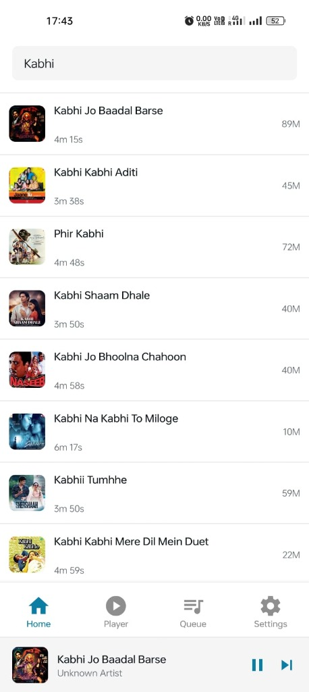
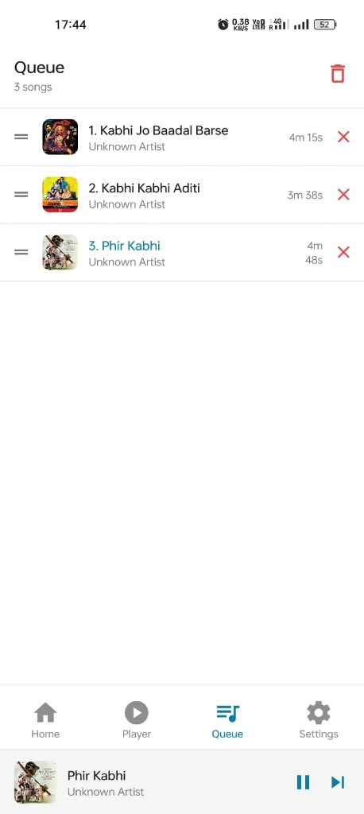

# 🎵 React Native Music Player


A beautiful, functional, and feature-rich music player application built with **React Native**, **Expo**, and **JioSaavn API**.
## 📦 Download Android APK

👉 **[Click here to download the latest APK](https://github.com/dk2430098/music_player/releases)**

> Download and install on any Android device to test the app.


## ✨ Features

*   **Search & Stream**: Search for any song, artist, or album and stream high-quality audio instantly.
*   **Mini Player**: Persistent mini-player across the app for seamless control.
*   **Full Player**: Immersive full-screen player with album art, scrubber, and playback controls (Play, Pause, Next, Previous, Shuffle, Repeat).
*   **Queue Management**: Add songs to queue, reorder, and clear queue.
*   **Background Playback**: specific configuration for background audio (requires expo-av setup).
*   **Modern UI**: Sleek, responsive design with dark mode support.

## 📸 Screenshots

| Home | Player |
|:---:|:---:|
|  |  |
| **Queue** | **Settings** |
|  |  |

## 🛠️ Tech Stack

*   **Framework**: [React Native](https://reactnative.dev/) (via [Expo](https://expo.dev/))
*   **Language**: [TypeScript](https://www.typescriptlang.org/)
*   **Navigation**: [Expo Router](https://docs.expo.dev/router/introduction/)
*   **State Management**: [Zustand](https://github.com/pmndrs/zustand)
*   **Audio**: `expo-av`
*   **Styling**: NativeWind (Tailwind CSS)
*   **API**: JioSaavn Unofficial API

## 🚀 Getting Started

### Prerequisites

*   Node.js (LTS recommended)
*   npm or yarn or pnpm
*   Expo Go app on your physical device (iOS/Android) OR Android Studio / Xcode for simulators.

### Installation

1.  **Clone the repository:**
    ```bash
    git clone https://github.com/dk2430098/music_player.git
    cd music_player
    ```

2.  **Install dependencies:**
    ```bash
    npm install
    # or
    yarn install
    ```

3.  **Run the app:**
    ```bash
    npm start
    # or
    npx expo start
    ```

4.  **Open the app:**
    *   **Physical Device**: Scan the QR code with the Expo Go app.
    *   **Simulator**: Press `i` for iOS Simulator or `a` for Android Emulator.

## 📱 Building the APK (Android)

To build the APK for distribution/testing:

1.  Install EAS CLI:
    ```bash
    npm install -g eas-cli
    ```

2.  Login to Expo:
    ```bash
    eas login
    ```

3.  Build the APK:
    ```bash
    eas build -p android --profile preview
    ```

## 🤝 Contributing

Contributions are welcome! Please fork the repository and submit a pull request.

## 📄 License

This project is licensed under the MIT License.
